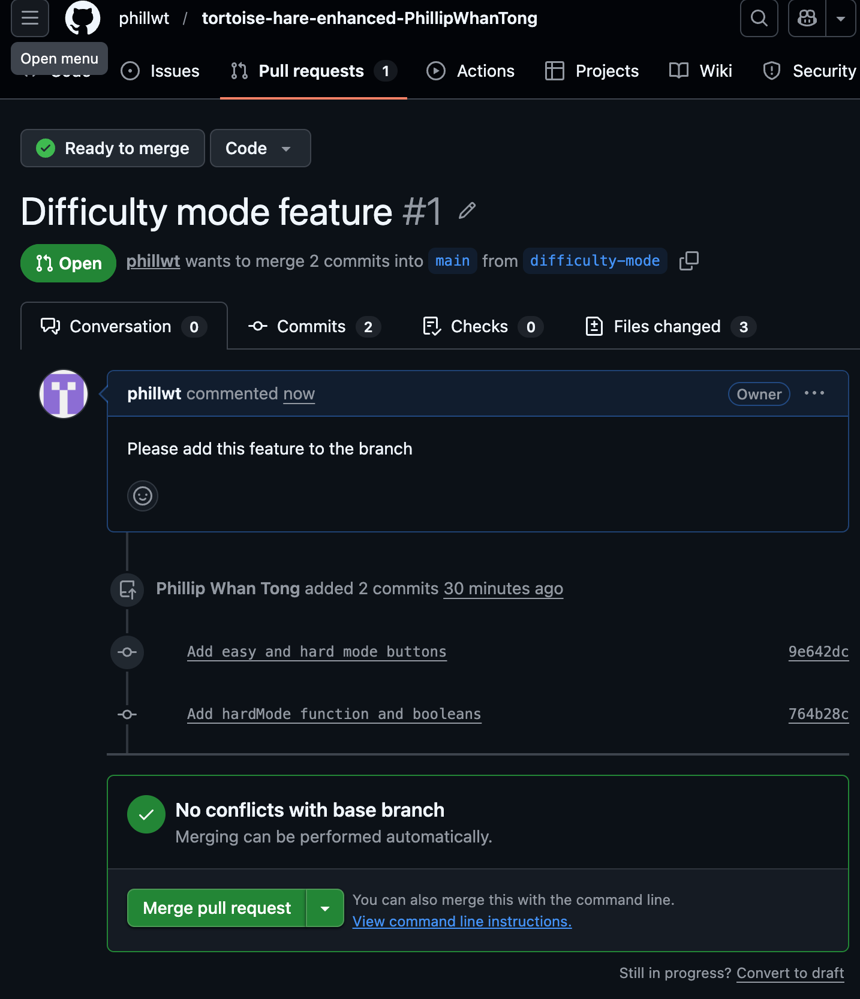

What feature did you implement?
I implemented the difficulty mode. I added a new hard mode and kept the original code fro the hare's movement as the easy mode.

What was the most difficult bug or issue?
The most difficult part was figuring out how to make the logic in deciding to use easy or hard mode. I solved this by using a boolean variable which would change depending on which button was clicked.

Paste your 3 best commit messages.
- "Add easy and hard mode buttons"
- "Add hardMode function and booleans"
- "Add README file for better unsderstanding"

Add a screenshot of your Pull Request page.

